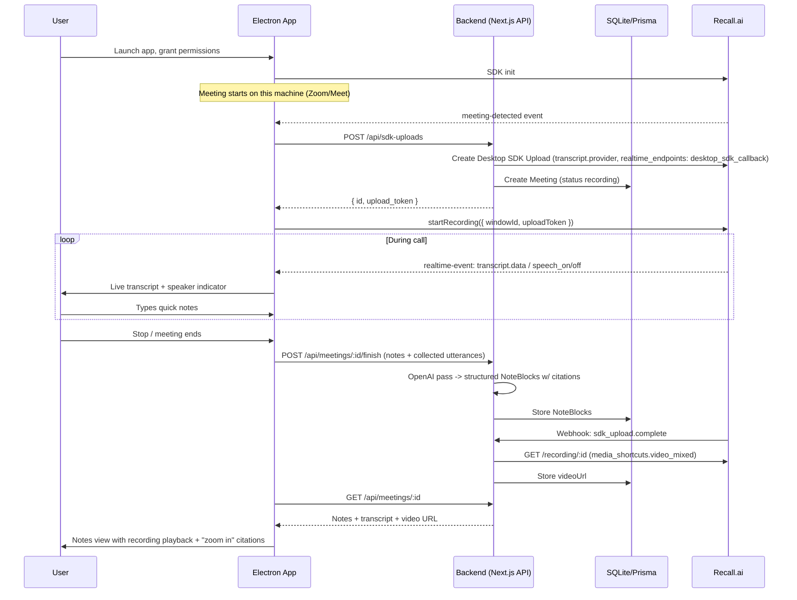

# Architecture

## Why the Desktop Recording SDK

Granola is not a "bot joins your call" product — it's a native desktop app that detects a meeting locally and captures it without ever appearing as a participant. Recall's [Desktop Recording SDK](https://docs.recall.ai/docs/desktop-sdk) is the primitive that actually matches that architecture: it detects meetings on-device and streams data straight into the app, with no bot avatar, no meeting-platform admission flow, and no extra participant in the call.

The alternative — Recall's Meeting Bot API — is simpler to build (pure backend, no OS constraints, works across every supported meeting platform identically) but produces a visibly different product: a bot named "Meeting Notetaker" joins the call. That's a fine architecture for a lot of Recall use cases, just not this one.

A third option worth knowing about: Recall's **Meeting Direct Connect** (botless server-side capture via Zoom RTMS or the Google Meet Media API) gets even closer to "invisible" than the Desktop SDK, without an Electron client at all. It wasn't used here, but is a good next architecture to evaluate.

## Recall.ai features this app uses

- **Desktop Recording SDK** — `RecallAiSdk.init`, `meeting-detected`/`meeting-updated` events, `startRecording`/`stopRecording`
- **Real-time transcription, in-process** — `recording_config.transcript.provider.recallai_streaming` + `realtime_endpoints: [{ type: "desktop_sdk_callback" }]` delivers `transcript.data`/`transcript.partial_data` straight into the app via the SDK's own event listener — no webhook hop needed for live data
- **Participant events** — `participant_events.speech_on/speech_off` for a live "who's talking" indicator, `participant_events.join/update` for names
- **SDK Upload lifecycle + webhooks** — Create Desktop SDK Upload, `sdk_upload.complete`/`sdk_upload.failed` webhooks
- **Recording + media shortcuts** — `media_shortcuts.video_mixed` for post-call playback, seekable to a note's source timestamp
- **Webhook verification** — HMAC verification of the SDK upload webhook

## Data flow

## Tech stack

- **Electron Forge + React + TypeScript** for the desktop client
- **Tailwind CSS** for the renderer UI
- **`@recallai/desktop-sdk`** in the Electron main process
- **A small Next.js (API routes only) backend** — issues SDK upload tokens, receives the `sdk_upload.*` webhook, runs the OpenAI synthesis pass, and persists data. No user-facing pages; the Electron renderer is the only UI.
- **Prisma + SQLite** for persistence
- **OpenAI API** (structured outputs) for the post-call notes synthesis pass
- **ngrok** static domain to expose the backend for the `sdk_upload.*` webhook in local dev

## Data model (Prisma)

- `Meeting`: id, sdkUploadId, recordingId, windowId, meetingUrl, meetingTitle, platform, status (`recording`/`processing`/`ready`/`failed`), videoUrl, createdAt, endedAt
- `Utterance`: id, meetingId, speakerName, text, startMs, endMs
- `ParticipantEvent`: id, meetingId, type, participantName, timestamp
- `NoteBlock`: id, meetingId, order, source (`user`|`ai`), text, sourceUtteranceIds (json array) — powers the black/gray note distinction and the "zoom in" citation link

## Electron app structure

- **main process** — `RecallAiSdk.init`, `requestPermission` calls, `meeting-detected`/`meeting-updated`/`realtime-event`/`recording-ended` listeners, HTTP calls to the backend, forwards events to the renderer over IPC
- **preload** — `contextBridge` exposing a safe, narrow API to the renderer (start/stop actions, event subscriptions)
- **renderer (React)** — Onboarding/Permissions, Live Meeting (notepad + live transcript + speaker indicator), Past Meetings list, Meeting Detail (structured notes + video player + citations)

## Backend routes

- `POST /api/sdk-uploads` — proxies Create Desktop SDK Upload (`transcript.provider.recallai_streaming`, `realtime_endpoints: [{ type: "desktop_sdk_callback", events: [...] }]`), creates local `Meeting`
- `POST /api/webhooks/recall/sdk` — verified `sdk_upload.complete`/`sdk_upload.failed` handler; on complete, fetches `Retrieve Recording` for `media_shortcuts.video_mixed`
- `POST /api/meetings/:id/finish` — Electron posts final notes + client-collected utterances/participant events; triggers the OpenAI synthesis pass
- `GET /api/meetings`, `GET /api/meetings/:id` — list/detail for the Past Meetings and Meeting Detail views

## Required setup

- Env vars: `RECALL_REGION`, `RECALL_API_KEY`, `RECALL_WORKSPACE_VERIFICATION_SECRET`, `PUBLIC_API_BASE_URL` (a static ngrok domain in dev), `OPENAI_API_KEY` — see `.env.example`
- All Recall API calls go through a retry helper that respects `Retry-After` on 429 and backs off on 503/507
- The SDK webhook route verifies Recall's signature before touching the payload, acknowledges immediately, and processes asynchronously
- Backend webhook subscribed to `sdk_upload.complete`, `sdk_upload.uploading`, `sdk_upload.failed`

## Recommended meeting platforms

Use **Zoom Desktop client** or **Google Meet in Chrome** — both are fully supported on Mac with just the three baseline permissions (microphone, accessibility, screen-capture). Teams and Safari-based Meet additionally require `full-disk-access`, so they're not the primary supported path here.

## Known limitations / not implemented

- **Windows** — built and tested on macOS (Apple Silicon) only; the SDK also supports Windows 10+ 64-bit, untested here
- **Teams and Safari-based Meet** — work with the SDK in principle, but need `full-disk-access`, which this app doesn't request
- **Adhoc/in-person audio recording** (`prepareDesktopAudioRecording`) — not built
- **Third-party STT providers** (AssemblyAI/Deepgram/Speechmatics) — only Recall.ai's own streaming transcription is wired up
- **Production packaging/code-signing** — runs unpacked in dev mode; Recall ships a patched `osx-sign` fork for real distribution
- **Calendar integration** — no auto-scheduling; the app only reacts to meetings detected live on the machine it runs on
- **Meeting Direct Connect** — a botless server-side alternative worth evaluating, not implemented here
